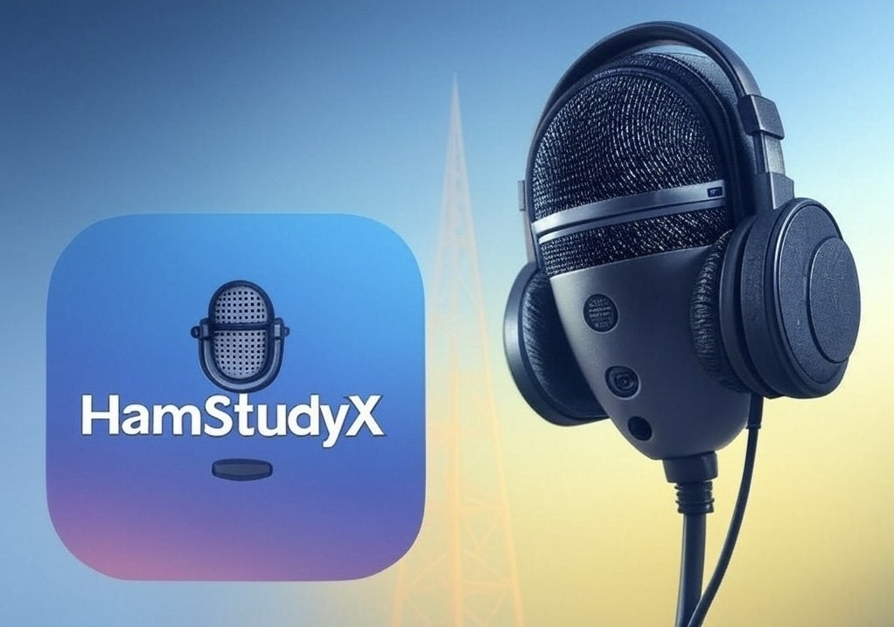

<h1>
  
  HamStudyX
</h1>  


*A Cross-Platform Ham Radio Exam Study App*

HamStudyX is a **cross-platform mobile application** designed to help users prepare for ham radio licensing exams. Built using **.NET MAUI**, it provides a structured way to practice multiple-choice and open-ended questions, track progress, and review quiz history — all within an intuitive interface.

---

## 📌 **Table of Contents**
- [Project Description](#project-description)
- [Features](#features)
- [Installation & Running](#installation-&-running)
- [Usage](#usage)
- [Screenshots](#screenshots)
- [Credits](#credits)
- [License](#license)

---

## <h2 id="project-description">📖 Project Description</h2>
### 🎯 **Motivation**
Studying for ham radio exams can be challenging without the right resources. **HamStudyX** was created to offer **a convenient and structured way** for aspiring ham radio operators to prepare effectively with the capablity to add and study other topics as well. 

### 🎯 **Purpose** 
✅ Provide a **structured** study experience  
✅ Offer **immediate feedback** on quiz performance  
✅ **Store quiz history** for progress tracking  
✅ Enhance learning through an **intuitive interface**  

### 🎯 **Problem Solved**
Limited options for studying & lacking additional interactive features.  
HamStudyX **solves this by**:  
✔ Centralizing study materials in one app  
✔ Simulating real exam conditions with **timed quizzes** (FUTURE FEATURE)  
✔ Allowing users to **focus on specific topics... including topics outside of Ham Radio**  

### 🎯 **Lessons Learned**
Developing HamStudyX provided valuable insights into:  
✔ **Building cross-platform applications** with .NET MAUI  
✔ Implementing **MVVM architecture** for maintainability  
✔ Utilizing **SQLite** for local data storage  
✔ Handling **asynchronous programming & exception management** in C#  

---

## <h2 id="features">✨ Features</h2>
✅ **Topic Selection** – Choose specific topics to focus your study besides Amateur radio  
✅ **Multiple Question Types** – Practice with multiple-choice & open-ended questions  
✅ **Quiz Session Management** – Start, pause(COMING SOON), and resume quizzes anytime  
✅ **Immediate Feedback** – Know instantly whether your answer is correct  
✅ **Quiz History** – Track and review past performances  
✅ **User-Friendly Interface** – Navigate effortlessly with a clean UI  

---

<h2 id="installation-&-running">🛠 Installation & Running</h2>
To install and run HamStudyX locally, follow these steps:

### **🔹 Prerequisites**
Ensure you have the following installed:  
- **.NET 8 SDK**  
- **.NET MAUI Workload** (Install via: `dotnet workload install maui`)  

### **🔹 Steps**
1️⃣ **Clone the Repository**  
```bash
git clone https://github.com/its-michaelroy/HamStudyX.git
```

2️⃣ **Navigate to the Project Directory**  
```bash
cd HamStudyX
```

3️⃣ **Restore Dependencies**  
Open the solution in **Visual Studio**, and restore NuGet packages when prompted.

4️⃣ **Build the Project**  
Select your **target platform** (Android, iOS, Windows) and build the project. (Currently built for Windows ONLY)

5️⃣ **Run the Application**  
Launch the app on an **emulator or physical device** connected to your development machine.  

---

## <h2 id="usage">🎮 Usage</h2>
### **🔹 Starting a Quiz**
1️⃣ **Launch the App** – Upon opening, you'll see the **Home Page**  
2️⃣ **Select a Topic** – Choose from available topics in the **Topic Picker**  
3️⃣ **Begin the Quiz** – Tap **Load Quiz** to start a session  

### **🔹 During a Quiz**
✔ **Question Display** – See the current question at the top  
✔ **Answering** – Tap an option for multiple-choice, or type an answer for open-ended questions  
✔ **Submit Answer** – Tap **Check Answer** for instant feedback  
✔ **Navigation** – Use **Next** to proceed, **Quit** to exit, or **Restart** to start over  

### **🔹 Viewing Quiz History**
📂 Navigate to the **History tab** to view past quiz results, including:  
✔ **Date Taken**  
✔ **Topic**  
✔ **Score Percentage**  

---

## <h2 id="screenshots">📸 Screenshots</h2>
### 📍 Home Screen
The home screen allows users to select topics and begin their quiz.


### 🎯 Quiz Interface
Users can answer multiple-choice and open-ended questions.


### 📊 Quiz History
The history tab helps users track their progress over time.


---

## <h2 id="credits">💡 Credits</h2>
👨‍💻 **Developer:** [Michael Roy](https://github.com/its-michaelroy)  
📚 **Resources:**  
- [.NET MAUI Documentation](https://learn.microsoft.com/en-us/dotnet/maui/)  
- [SQLite](https://www.sqlite.org/index.html) for local data storage  
- [MVVM](https://learn.microsoft.com/en-us/dotnet/maui/xaml/fundamentals/mvvm?view=net-maui-9.0) architecture tutorials  

---

## <h2 id="license">📜 License</h2>
This project is licensed under the **MIT License**. See the [LICENSE](LICENSE) file for details.